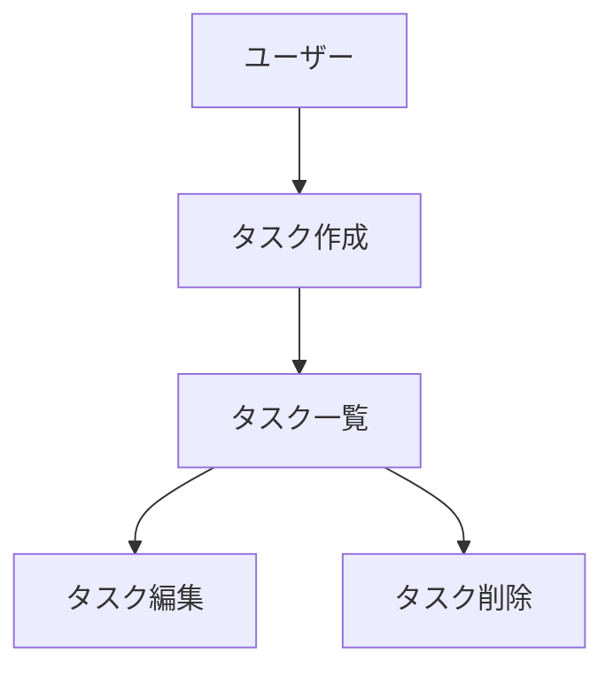

# CLAUDE.md（プロジェクトメモリ）

## 概要

開発を進めるうえで遵守すべき標準ルールを定義します。

## プロジェクト構造

本リポジトリは、タスク管理アプリケーション専用のリポジトリです。

### ドキュメントの分類

#### 1. 永続的ドキュメント（`docs/`）

アプリケーション全体の「**何を作るか**」「**どう作るか**」を定義する恒久的なドキュメント。
アプリケーションの基本設計や方針が変わらない限り更新されません。

- **`product-requirements.md`** - プロダクト要求定義書
  - プロダクトビジョンと目的
  - ターゲットユーザーと課題・ニーズ
  - 主要な機能一覧
  - 成功の定義
  - ビジネス要件
  - ユーザーストーリー
  - 受け入れ条件
  - 機能要件
  - 非機能要件

- **`functional-design.md`** - 機能設計書
  - 機能ごとのアーキテクチャ
  - システム構成図
  - データモデル定義（ER図含む）
  - コンポーネント設計
  - ユースケース図、画面遷移図、ワイヤフレーム
  - API設計（将来的にバックエンドと連携する場合）

- **`architecture.md`** - 技術仕様書
  - テクノロジースタック
  - 開発ツールと手法
  - 技術的制約と要件
  - パフォーマンス要件

- **`repository-structure.md`** - リポジトリ構造定義書
  - フォルダ・ファイル構成
  - ディレクトリの役割
  - ファイル配置ルール

- **`development-guidelines.md`** - 開発ガイドライン
  - コーディング規約
  - 命名規則
  - スタイリング規約
  - テスト規約
  - Git規約

- **`glossary.md`** - ユビキタス言語定義
  - ドメイン用語の定義
  - ビジネス用語の定義
  - UI/UX用語の定義
  - 英語・日本語対応表
  - コード上の命名規則

#### 2. 作業単位のドキュメント（`.steering/[YYYYMMDD]-[開発タイトル]/`）

特定の開発作業における「**今回何をするか**」を定義する一時的なステアリングファイル。
作業完了後は参照用として保持されますが、新しい作業では新しいディレクトリを作成します。

- **`requirements.md`** - 今回の作業の要求内容
  - 変更・追加する機能の説明
  - ユーザーストーリー
  - 受け入れ条件
  - 制約事項

- **`design.md`** - 変更内容の設計
  - 実装アプローチ
  - 変更するコンポーネント
  - データ構造の変更
  - 影響範囲の分析

- **`tasklist.md`** - タスクリスト
  - 具体的な実装タスク
  - タスクの進捗状況
  - 完了条件

### ステアリングディレクトリの命名規則

```
.steering/[YYYYMMDD]-[開発タイトル]/
```

**例:**
- `.steering/20250103-initial-implementation/`
- `.steering/20250115-add-tag-feature/`
- `.steering/20250120-fix-filter-bug/`
- `.steering/20250201-improve-performance/`

## 開発プロセス

### 初回セットアップ時の手順

#### 1. フォルダ作成
```bash
mkdir -p docs
mkdir -p .steering
```

#### 2. 永続的ドキュメント作成（`docs/`）

アプリケーション全体の設計を定義します。
各ドキュメントを作成後、必ず確認・承認を得てから次に進みます。

1. `docs/product-requirements.md` - プロダクト要求定義書
2. `docs/functional-design.md` - 機能設計書
3. `docs/architecture.md` - 技術仕様書
4. `docs/repository-structure.md` - リポジトリ構造定義書
5. `docs/development-guidelines.md` - 開発ガイドライン
6. `docs/glossary.md` - ユビキタス言語定義

**重要:** ファイルごとに作成後、必ず確認・承認を得てから次のファイル作成を行う

#### 3. 初回実装用のステアリングファイル作成

初回実装用のディレクトリを作成し、実装に必要なドキュメントを配置します。

```bash
mkdir -p .steering/[YYYYMMDD]-initial-implementation
```

作成するドキュメント:
1. `.steering/[YYYYMMDD]-initial-implementation/requirements.md` - 初回実装の要求
2. `.steering/[YYYYMMDD]-initial-implementation/design.md` - 実装設計
3. `.steering/[YYYYMMDD]-initial-implementation/tasklist.md` - 実装タスク

#### 4. 環境セットアップ

#### 5. 実装開始

`.steering/[YYYYMMDD]-initial-implementation/tasklist.md`に基づいて実装を進めます。

#### 6. 品質チェック

### 機能追加・修正時の手順

#### 1. 影響分析

- 永続的ドキュメント（`docs/`）への影響を確認
- 変更が基本設計に影響する場合は`docs/`を更新

#### 2. ステアリングディレクトリ作成

新しい作業用のディレクトリを作成します。

```bash
mkdir -p .steering/[YYYYMMDD]-[開発タイトル]
```

**例:**
```bash
mkdir -p .steering/20250115-add-tag-feature
```

#### 3. 作業ドキュメント作成

作業単位のドキュメントを作成します。
各ドキュメント作成後、必ず確認・承認を得てから次に進みます。

1. `.steering/[YYYYMMDD]-[開発タイトル]/requirements.md` - 要求内容
2. `.steering/[YYYYMMDD]-[開発タイトル]/design.md` - 設計
3. `.steering/[YYYYMMDD]-[開発タイトル]/tasklist.md` - タスクリスト

**重要:** ファイルごとに作成後、必ず確認・承認を得てから次のファイル作成を行う

#### 4. 永続的ドキュメント更新（必要な場合のみ）

変更が基本設計に影響する場合、該当する`docs/`内のドキュメントを更新します。

#### 5. 実装開始

`.steering/[YYYYMMDD]-[開発タイトル]/tasklist.md`に基づいて実装を進めます。

#### 6. 品質チェック

## ドキュメント管理の原則

### 永続的ドキュメント（`docs/`）
- アプリケーションの基本設計を記述
- 頻繁に更新されない
- 大きな設計変更時のみ更新
- プロジェクト全体の「北極星」として機能

### 作業単位のドキュメント（`.steering/`）
- 特定の作業・変更に特化
- 作業ごとに新しいディレクトリを作成
- 作業完了後は履歴として保持
- 変更の意図と経緯を記録

## 図表・ダイアグラムの記載ルール

### 記載場所

設計図やダイアグラムは、関連する永続的ドキュメント内に直接記載します。
独立した`diagrams`フォルダは作成せず、手間を最小限に抑えます。

**配置例:**
- ER図、データモデル図 → `functional-design.md`内に記載
- ユースケース図 → `functional-design.md`または`product-requirements.md`内に記載
- 画面遷移図、ワイヤフレーム → `functional-design.md`内に記載
- システム構成図 → `functional-design.md`または`architecture.md`内に記載

### 記述形式

1. **Mermaid記法（推奨）**
   - Markdownに直接埋め込める
   - バージョン管理が容易
   - ツール不要で編集可能



2. **ASCIIアート**
   - シンプルな図表に使用
   - テキストエディタで編集可能

```
┌─────────────────┐
│     Header      │
└─────────────────┘
         │
         ↓
┌─────────────────┐
│   Task List     │
└─────────────────┘
```

3. **画像ファイル（必要な場合のみ）**
   - 複雑なワイヤフレームやモックアップ
   - `docs/images/`フォルダに配置
   - PNG または SVG 形式を推奨

### 図表の更新

- 設計変更時は対応する図表も同時に更新
- 図表とコードの乖離を防ぐ

## プロジェクト概要

Article Managerは、AI機能を搭載した技術記事管理のフルスタックWebアプリケーションです。システムは以下で構成されています：

- **バックエンド (API)**: Clean Architectureに従ったGo言語ベースのREST API
- **フロントエンド**: Next.js 16 (App Router) + React 19 + TypeScript
- **データベース**: MySQL 8.0
- **AI統合**: 記事生成と書籍推薦のためのGoogle Gemini API

## アーキテクチャ

### バックエンド (Go)

APIはClean Architectureに従い、明確な関心の分離を実現しています：

```
api/
├── cmd/server/main.go           # アプリケーションエントリーポイント、依存性注入
├── internal/
│   ├── domain/                  # エンタープライズビジネスルール
│   │   ├── entity/              # ドメインエンティティ (Article, Tag, BookRecommendation)
│   │   ├── repository/          # リポジトリインターフェース
│   │   ├── service/             # ドメインサービス
│   │   └── errors/              # ドメイン固有のエラー
│   ├── usecase/                 # アプリケーションビジネスルール
│   ├── interface/handler/       # HTTPハンドラー (コントローラー)
│   └── infrastructure/          # 外部依存
│       ├── repository/          # リポジトリ実装 (MySQL)
│       ├── database/            # DB接続、マイグレーションマネージャー
│       ├── ai/                  # Geminiクライアント
│       ├── logger/              # Zapロガー
│       └── service/             # インフラストラクチャサービス
```

**主要な設計パターン:**
- Clean Architecture: 依存関係は内側を向く (domain ← usecase ← interface ← infrastructure)
- Repository Pattern: MySQLとインメモリ実装によるデータアクセスの抽象化
- Dependency Injection: すべての依存関係はmain.goで注入

### フロントエンド (Next.js)

モダンなNext.js App Routerアーキテクチャ、関心の分離を実現：

```
frontend/
├── app/                         # Next.js App Routerページ
│   ├── layout.tsx               # ルートレイアウト
│   ├── page.tsx                 # ホームページ (ダッシュボード)
│   ├── articles/                # 記事ページ
│   │   ├── page.tsx             # 記事一覧
│   │   ├── new/page.tsx         # 記事作成
│   │   └── [id]/                # 動的ルート
│   └── tags/page.tsx            # タグ管理
├── components/                  # 再利用可能なUIコンポーネント
├── hooks/                       # データ取得用のカスタムReact Hooks
│   ├── useArticles.ts           # 記事のCRUD操作
│   ├── useArticleSearch.ts      # 検索機能
│   ├── useTags.ts               # タグ操作
│   └── useBookRecommendations.ts
├── types/                       # TypeScript型定義
├── contexts/                    # React Context (ToastContext)
└── config/constants.ts          # アプリ全体の定数
```

**主要なパターン:**
- カスタムフックでAPI呼び出しと状態管理をカプセル化
- 継承よりもコンポーネント合成
- 横断的関心事（トースト）にContext使用
- TypeScriptによる型安全なAPI通信

## 開発コマンド

### バックエンド (Go API)

```bash
# ホットリロードで実行 (Air)
cd api && air -c .air.toml

# バイナリをビルド
cd api && go build -o server cmd/server/main.go

# テスト実行
cd api && go test ./...

# リポジトリテスト実行（テストデータベースが必要）
# 1. テストデータベースを起動:
docker-compose -f docker-compose-test.yml up -d

# 2. マイグレーション実行（初回のみ）:
docker exec -i {container_id} mysql -utest_user -ptest_password article_manager_test < api/internal/infrastructure/database/migrations/000001_create_articles_table.up.sql

# 3. リポジトリテスト実行:
cd api && go test -v ./internal/infrastructure/repository/

# 4. テストデータベースを停止:
docker-compose -f docker-compose-test.yml down
```

### フロントエンド (Next.js)

```bash
cd frontend

# 開発サーバー起動
npm run dev

# 本番ビルド
npm run build

# 本番サーバー起動
npm run start

# Lint実行
npm run lint

# テスト実行
npm run test              # すべてのテストを実行
npm run test:ui           # UIでテストを実行
npm run test:coverage     # カバレッジレポート付きでテストを実行
```

### フルスタック (Docker Compose)

```bash
# すべてのサービスを起動（.envファイルが必要）
docker-compose up -d

# ログを表示
docker-compose logs -f [api|frontend|db]

# すべてのサービスを停止
docker-compose down

# コンテナを再ビルド
docker-compose up -d --build
```

**必要な環境変数（ルートの.env）:**
```
MYSQL_ROOT_PASSWORD=<root_password>
MYSQL_DATABASE=article_manager
MYSQL_USER=<db_user>
MYSQL_PASSWORD=<db_password>
DB_PORT=3306
API_PORT=8080
FRONTEND_PORT=3000
GEMINI_API_KEY=<your_gemini_api_key>
GOOGLE_BOOKS_API_KEY=<your_books_api_key>
```

## テスト戦略

### バックエンドテスト

- **ユニットテスト**: ドメインエンティティとサービス
- **統合テスト**: テストデータベースを使用したリポジトリ層
- **ハンドラーテスト**: モックusecaseを使用したHTTPハンドラー
- フレームワーク: testify/assert、testify/mock

テストファイルはGoの規約に従います: 実装ファイルと並んで`*_test.go`

### フロントエンドテスト

- **コンポーネントテスト**: ユーザー操作を含むUIコンポーネント
- **フックテスト**: APIモッキングを使用したカスタムフック
- フレームワーク: Vitest、Testing Library、Happy-DOM
- 設定: `vitest.config.ts`、`vitest.setup.ts`

開発中はフロントエンドテストを頻繁に実行してください - テストスイートは高速で包括的です。

## APIエンドポイント

Base URL: `http://localhost:8080/api`

**記事（Articles）:**
- `GET /articles` - 記事一覧取得
- `GET /articles/search?q={query}&tags={tag1,tag2}` - 記事検索
- `GET /articles/{id}` - 記事詳細取得
- `POST /articles` - 記事作成
- `POST /articles/generate` - URLからAIで記事を自動生成
- `PUT /articles/{id}` - 記事更新
- `DELETE /articles/{id}` - 記事削除

**タグ（Tags）:**
- `GET /tags` - タグ一覧取得
- `GET /tags/{id}` - タグ詳細取得
- `POST /tags` - タグ作成
- `PUT /tags/{id}` - タグ更新
- `DELETE /tags/{id}` - タグ削除

**書籍推薦（Book Recommendations）:**
- `GET /book-recommendations` - 記事に基づくAI生成の書籍推薦を取得

## データベースマイグレーション

アプリケーションは`infrastructure/database/migration.go`に組み込まれたマイグレーションシステムを使用します。マイグレーションはアプリケーション起動時に自動実行されます。

マイグレーションファイルはビルド時にバイナリに埋め込まれます（埋め込まれたSQLファイルは`database/migration.go`を参照）。

開発中の手動マイグレーション:
```bash
# 開発データベースに接続
docker exec -it db mysql -u${MYSQL_USER} -p${MYSQL_PASSWORD} ${MYSQL_DATABASE}

# テストデータベースに接続
docker exec -it mysql_test mysql -utest_user -ptest_password article_manager_test
```

## 主要な実装詳細

### バックエンド

1. **グレースフルシャットダウン**: APIはSIGTERM/SIGINTをハンドリングし、30秒のタイムアウトでグレースフルシャットダウンを実装
2. **CORS**: すべてのオリジン（`*`）を許可するように設定 - 本番環境では制限してください
3. **ロギング**: zapによる構造化ログ、環境固有の設定
4. **エラーハンドリング**: `handler/error_handler.go`で一元的なエラーハンドリング
5. **AI統合**: `infrastructure/ai/gemini_client.go`のGeminiクライアントで記事生成と書籍推薦

### フロントエンド

1. **API設定**: `config/constants.ts`でベースURLを設定、環境変数によるオーバーライドをサポート
2. **エラーバウンダリー**: `components/ErrorBoundary.tsx`がReactエラーをキャッチ
3. **トースト通知**: `contexts/ToastContext.tsx`がアプリ全体の通知を提供
4. **検索デバウンス**: API呼び出しを減らすため検索入力をデバウンス
5. **フォームバリデーション**: `config/constants.ts`の定数を使用したクライアント側バリデーション
6. **AI機能**:
   - URLからの記事生成と自動タグ抽出
   - 保存された記事に基づく書籍推薦

### Context7統合

このプロジェクトで使用されているライブラリの最新ドキュメントを取得するには、Claudeプロンプトに`use context7`を追加してください。Go、React、Next.js、その他の依存関係の最新ドキュメントにアクセスできます。

## よくある開発タスク

### 新しいAPIエンドポイントの追加

1. `domain/entity/`でドメインエンティティを定義
2. `domain/repository/`でリポジトリインターフェースを作成
3. `infrastructure/repository/`でリポジトリを実装
4. `usecase/`でusecaseを作成
5. `interface/handler/`でハンドラーを実装
6. `cmd/server/main.go`でルートを登録
7. 各レイヤーのテストを記述

### 新しいフロントエンド機能の追加

1. `types/`でTypeScript型を定義
2. データ取得のため`hooks/`でカスタムフックを作成
3. `components/`でUIコンポーネントを構築
4. `app/`でページを作成または更新
5. コンポーネントとフックのテストを記述
6. 必要に応じて`config/constants.ts`の定数を更新

### データベース問題のデバッグ

マイグレーション状態の確認:
```bash
# API起動時のマイグレーションログを表示
docker-compose logs api | grep -i migration

# データベーススキーマを確認
docker exec -it db mysql -u${MYSQL_USER} -p${MYSQL_PASSWORD} ${MYSQL_DATABASE}
mysql> SHOW TABLES;
mysql> DESCRIBE articles;
```

## 注意事項

### ドキュメント管理

- **ドキュメントの作成・更新は段階的に行い、各段階で承認を得る**
- **`.steering/`のディレクトリ名は日付と開発タイトルで明確に識別できるようにする**
- **永続的ドキュメントと作業単位のドキュメントを混同しない**
- **コード変更後は必ずリント・型チェックを実施する**
- **共通のデザインシステム（Tailwind CSS）を使用して統一感を保つ**
- **セキュリティを考慮したコーディング（XSS対策、入力バリデーションなど）**
- **図表は必要最小限に留め、メンテナンスコストを抑える**

### 開発環境

- **リポジトリテスト**: MySQLテストコンテナを先に起動する必要があります（上記コマンド参照）
- **Air**: 開発中のホットリロードに使用 - 設定は`.air.toml`
- **フロントエンドアーキテクチャ**: `frontend/ARCHITECTURE.md`に詳細な説明（新卒向けの包括的ガイド）
- **Clean Architecture**: 依存関係の方向を維持 - 外側のレイヤーから内側のレイヤーへのインポートは禁止
- **APIクライアント**: フロントエンドはネイティブのfetch APIを使用、外部HTTPクライアントライブラリは不使用
