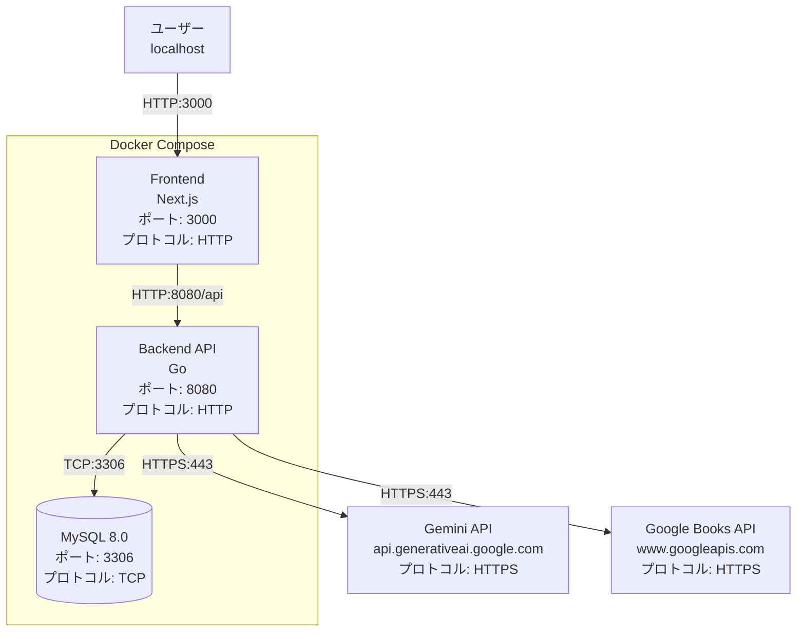
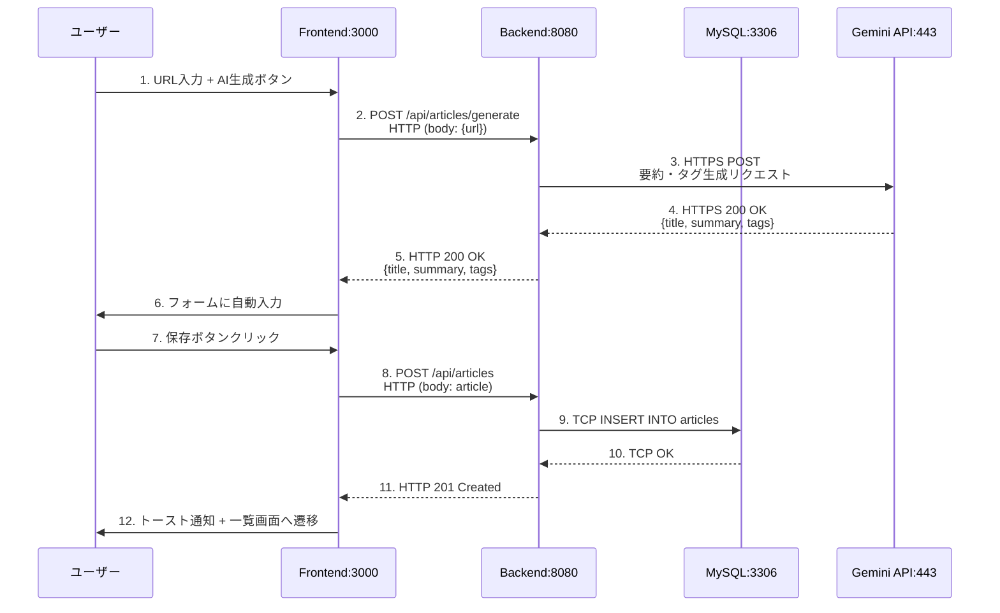
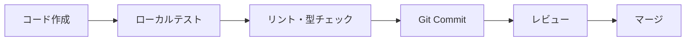

# 技術仕様書

## Article Manager - アーキテクチャ設計

---

## 目次

1. [アーキテクチャ概要](#1-アーキテクチャ概要)
2. [技術スタック](#2-技術スタック)
3. [開発ツールと手法](#3-開発ツールと手法)
4. [技術的制約と要件](#4-技術的制約と要件)
5. [パフォーマンス要件](#5-パフォーマンス要件)
6. [デプロイ・運用](#6-デプロイ運用)
7. [セキュリティ](#7-セキュリティ)

---

## 1. アーキテクチャ概要

### 1.1 アーキテクチャパターン

**採用パターン**: Clean Architecture + Layered Architecture

**設計原則**:
- 依存関係は内側に向かう（外側のレイヤーが内側のレイヤーに依存）
- ビジネスロジックは外部の詳細から独立
- テスタビリティと保守性の向上

### 1.2 レイヤー構成

```
┌─────────────────────────────────┐
│     Presentation Layer          │  ← UI (Next.js)
├─────────────────────────────────┤
│     Interface Layer             │  ← HTTP Handlers
├─────────────────────────────────┤
│     Use Case Layer              │  ← Business Logic
├─────────────────────────────────┤
│     Domain Layer                │  ← Entities, Repositories
├─────────────────────────────────┤
│     Infrastructure Layer        │  ← DB, AI Client
└─────────────────────────────────┘
```

**各レイヤーの責務**:

| レイヤー | 責務 | 主要コンポーネント |
|---------|------|-------------------|
| **Presentation** | ユーザーインターフェース、画面表示 | Next.js Pages, React Components |
| **Interface** | HTTPリクエスト/レスポンス処理 | HTTP Handlers, Controllers |
| **Use Case** | アプリケーションビジネスロジック | Use Cases, Application Services |
| **Domain** | エンタープライズビジネスルール | Entities, Domain Services, Repository Interfaces |
| **Infrastructure** | 外部システムとの統合 | DB Access, AI Client, External APIs |

### 1.3 システム構成図

#### 1.3.1 開発環境構成



**ポート・プロトコル一覧**:

| サービス | ポート | プロトコル | 公開範囲 | 用途 |
|---------|--------|----------|---------|------|
| Frontend | 3000 | HTTP | localhost | ユーザーインターフェース |
| Backend API | 8080 | HTTP | localhost | REST API |
| MySQL | 3306 | TCP | Docker network内 | データベース |
| Gemini API | 443 | HTTPS | インターネット | AI生成 |
| Google Books API | 443 | HTTPS | インターネット | 書籍検索 |

**ネットワーク構成**:
- Dockerネットワーク名: `article_manager_network`
- サブネット: `172.20.0.0/16`（Docker Composeのデフォルト）
- Frontend: `172.20.0.2`
- API: `172.20.0.3`
- DB: `172.20.0.4`

#### 1.3.2 データフロー図

**記事作成フロー（AI生成使用時）**:



**プロトコル・ポート詳細**:
1. User → Frontend: HTTP/1.1, ポート3000
2. Frontend → Backend: HTTP/1.1, ポート8080, パス`/api/*`
3. Backend → MySQL: TCP, ポート3306, MySQL Protocolバイナリ
4. Backend → Gemini API: HTTPS/2, ポート443, REST API
5. Backend → Google Books API: HTTPS/2, ポート443, REST API

---

## 2. 技術スタック

### 2.1 フロントエンド

| カテゴリ | 技術 | バージョン | 選定理由 |
|---------|------|-----------|---------|
| **フレームワーク** | Next.js (App Router) | 16 | React ベースのモダンフレームワーク、SSR/SSG対応 |
| **UIライブラリ** | React | 19 | 業界標準、豊富なエコシステム |
| **言語** | TypeScript | 5 | 型安全性、開発効率向上 |
| **スタイリング** | Tailwind CSS | 4 | ユーティリティファースト、開発速度向上 |
| **状態管理** | React Hooks + Context API | - | 標準機能、追加ライブラリ不要 |
| **テスト** | Vitest + Testing Library | - | 高速、React テストに最適 |
| **HTTPクライアント** | Fetch API (標準) | - | 追加ライブラリ不要、軽量 |

**ディレクトリ構成**:
```
frontend/
├── app/                    # Next.js App Router ページ
│   ├── layout.tsx          # ルートレイアウト
│   ├── page.tsx            # ホームページ
│   ├── articles/           # 記事関連ページ
│   └── tags/               # タグ管理ページ
├── components/             # 再利用可能なUIコンポーネント
├── hooks/                  # カスタムReact Hooks
├── types/                  # TypeScript型定義
├── contexts/               # React Context
└── config/                 # 設定ファイル
```

### 2.2 バックエンド

| カテゴリ | 技術 | バージョン | 選定理由 |
|---------|------|-----------|---------|
| **言語** | Go | 1.25 | 高パフォーマンス、並行処理、型安全 |
| **Webフレームワーク** | 標準ライブラリ (net/http) | - | 軽量、依存関係最小化 |
| **データベースライブラリ** | sqlx | - | 柔軟性とパフォーマンスのバランス |
| **ロガー** | zap | - | 高性能構造化ログ |
| **テスト** | testify | - | アサーション、モック機能充実 |
| **ホットリロード** | Air | - | 開発効率向上 |

**ディレクトリ構成（Clean Architecture）**:
```
api/
├── cmd/
│   └── server/
│       └── main.go              # エントリーポイント、依存性注入
├── internal/
│   ├── domain/                  # ドメイン層
│   │   ├── entity/              # エンティティ
│   │   ├── repository/          # リポジトリインターフェース
│   │   ├── service/             # ドメインサービス
│   │   └── errors/              # ドメインエラー
│   ├── usecase/                 # ユースケース層
│   ├── interface/
│   │   └── handler/             # インターフェース層（HTTPハンドラー）
│   └── infrastructure/          # インフラ層
│       ├── repository/          # リポジトリ実装
│       ├── database/            # DB接続、マイグレーション
│       ├── ai/                  # Geminiクライアント
│       ├── logger/              # ロガー
│       └── service/             # インフラサービス
└── test/                        # テストユーティリティ
```

**設計パターン**:
- **Repository Pattern**: データアクセスの抽象化
- **Dependency Injection**: main.goで依存関係を注入
- **Interface Segregation**: 最小限のインターフェース定義

### 2.3 データベース

| カテゴリ | 技術 | バージョン | 選定理由 |
|---------|------|-----------|---------|
| **RDBMS** | MySQL | 8.0 | 信頼性、業界標準、豊富な機能 |
| **マイグレーション** | 組み込み型マイグレーションシステム | - | シンプル、バイナリに埋め込み可能 |

**マイグレーション戦略**:
- SQLファイルをバイナリに埋め込み
- アプリケーション起動時に自動実行
- バージョン管理によるロールバック対応

### 2.4 AI/外部API

| サービス | 用途 | API |
|---------|------|-----|
| **Google Gemini API** | 記事要約生成、タグ抽出 | Gemini 1.5 Flash |
| **Google Books API** | 書籍情報検索、推薦 | Books API v1 |

**API統合設計**:
- クライアントのインターフェース化（モック可能）
- タイムアウト、基本的なリトライ処理
- APIキーの安全な管理（環境変数）

**タイムアウト設定**:

| API | タイムアウト | 理由 |
|-----|------------|------|
| **Gemini API** | 30秒 | AI生成に時間がかかる |
| **Google Books API** | 10秒 | 検索APIは高速 |

**基本的なエラーハンドリング**:
- ネットワークタイムアウト時のリトライ（最大3回）
- API障害時のエラーメッセージ表示
- フォールバック: 空の結果を返し、手動入力を促す

### 2.5 インフラストラクチャ

| カテゴリ | 技術 | 説明 |
|---------|------|------|
| **コンテナ** | Docker + Docker Compose | 開発環境の統一、簡単なセットアップ |
| **環境変数管理** | .env | 機密情報の外部化 |
| **開発ツール** | Air (Go)、npm (Node.js) | ホットリロード、パッケージ管理 |

**Docker構成**:
```yaml
services:
  - frontend: Next.js (ポート 3000)
  - api: Go API (ポート 8080)
  - db: MySQL (ポート 3306)
```

---

## 3. 開発ツールと手法

### 3.1 開発環境

**必要なツール**:
- Docker Desktop
- Go 1.25+
- Node.js 20+
- Git

**エディタ推奨設定**:
- VSCode / Cursor
- Go拡張機能
- ESLint / Prettier
- Tailwind CSS IntelliSense

### 3.2 開発フロー



### 3.3 テスト戦略

| レイヤー | テストタイプ | ツール | カバレッジ目標 |
|---------|------------|--------|--------------|
| **フロントエンド** | コンポーネントテスト | Vitest + Testing Library | 80%+ |
| **フロントエンド** | フックテスト | Vitest | 80%+ |
| **バックエンド** | ユニットテスト | testify | 70%+ |
| **バックエンド** | 統合テスト（リポジトリ） | testify + テストDB | 80%+ |
| **バックエンド** | ハンドラーテスト | testify + モック | 70%+ |

**テスト実行コマンド**:
```bash
# フロントエンド
cd frontend && npm run test

# バックエンド
cd api && go test ./...

# リポジトリ統合テスト（テストDB必要）
docker-compose -f docker-compose-test.yml up -d
cd api && go test -v ./internal/infrastructure/repository/
```

### 3.4 コード品質管理

| ツール | 用途 | 実行タイミング |
|-------|------|---------------|
| **ESLint** | JavaScript/TypeScript静的解析 | 保存時、コミット前 |
| **Prettier** | コード整形 | 保存時 |
| **gofmt** | Goコード整形 | 保存時 |
| **golangci-lint** | Go静的解析 | コミット前（推奨） |

---

## 4. 技術的制約と要件

### 4.1 技術的制約

| 制約項目 | 内容 | 理由 |
|---------|------|------|
| **認証機能** | Phase 1では未実装 | 開発期間短縮、MVP検証優先 |
| **マルチテナント** | 未対応 | Phase 1は単一ユーザー想定 |
| **ファイルアップロード** | 未対応 | スコープ外 |
| **リアルタイム同期** | 未対応 | 現状不要 |

### 4.2 外部依存

| 依存先 | 影響範囲 | リスク | 対策 |
|-------|---------|--------|------|
| **Gemini API** | 記事生成機能 | サービス停止、料金変更 | フォールバック処理、コスト監視 |
| **Google Books API** | 書籍推薦機能 | サービス停止 | エラーハンドリング |
| **MySQL** | 全データ | データ損失 | 定期バックアップ |

### 4.3 データ制約

| 項目 | 制約値 | 理由 |
|-----|--------|------|
| **記事URL最大長** | 2048文字 | URL仕様に準拠 |
| **記事要約最大長** | 1000文字 | 読みやすさ、DB効率 |
| **タグ名最大長** | 50文字 | UI表示の制約 |
| **記事のタグ数** | 10個 | パフォーマンスとUX |
| **メモ最大長** | 65535文字 (TEXT) | MySQL TEXT型の制限 |

### 4.4 運用制約

| 項目 | 制約 | 理由 |
|-----|------|------|
| **デプロイ環境** | Docker対応環境 | コンテナ化前提 |
| **最小リソース** | CPU 2コア、メモリ 4GB | 開発・テスト環境 |
| **ログ保存期間** | 30日間 | 個人開発のため短期保存 |

---

## 5. パフォーマンス要件

### 5.1 レスポンスタイム目標

| 操作 | 目標 | 許容上限 |
|-----|------|---------|
| **記事一覧表示** | < 500ms | < 1s |
| **記事検索** | < 800ms | < 2s |
| **記事作成（手動）** | < 300ms | < 500ms |
| **AI記事生成** | < 10s | < 30s |
| **書籍推薦生成** | < 5s | < 15s |

### 5.2 スケーラビリティ

| 指標 | 目標値 | 備考 |
|-----|--------|------|
| **同時ユーザー数** | 1人 | 個人利用 |
| **記事データ量** | 10,000件 | 十分な余裕 |
| **1日あたりのAPI呼び出し** | 100リクエスト | コスト管理 |

### 5.3 可用性

| 項目 | 目標 | 備考 |
|-----|------|------|
| **稼働率** | ベストエフォート | 個人開発環境 |
| **データバックアップ** | 週次（手動） | 5.6節参照 |
| **復旧時間目標（RTO）** | 24時間 | 個人利用のため |
| **復旧ポイント目標（RPO）** | 1週間 | 週次バックアップのため |

---

## 6. デプロイ・運用

### 6.1 環境構築手順

#### 6.1.1 初回セットアップ（開発環境）

**前提条件**:
- Docker Desktop インストール済み
- Git インストール済み

**手順**:

```bash
# 1. リポジトリをクローン
git clone <repository-url>
cd article_manager

# 2. .envファイルを作成（ルートディレクトリ）
cat > .env << 'EOF'
MYSQL_ROOT_PASSWORD=rootpassword
MYSQL_DATABASE=article_manager
MYSQL_USER=app_user
MYSQL_PASSWORD=app_password
DB_PORT=3306
API_PORT=8080
FRONTEND_PORT=3000
GEMINI_API_KEY=<your_gemini_api_key>
GOOGLE_BOOKS_API_KEY=<your_books_api_key>
EOF

# 3. Dockerコンテナをビルド・起動
docker-compose up -d --build

# 4. マイグレーション実行（自動実行される）
# APIコンテナ起動時に自動でマイグレーションが実行されます

# 5. 動作確認
curl http://localhost:8080/api/articles  # APIヘルスチェック
open http://localhost:3000               # フロントエンド確認
```

**トラブルシューティング**:
```bash
# ログ確認
docker-compose logs -f api
docker-compose logs -f frontend
docker-compose logs -f db

# コンテナ再起動
docker-compose restart api

# 完全クリーンアップ
docker-compose down -v
docker-compose up -d --build
```

#### 6.1.2 シークレット管理

**開発環境**:
- `.env`ファイルで管理（Gitに含めない）
- `.env.example`をテンプレートとして提供

**セキュリティ対策**:
- `.env`をGitignoreに追加
- パスワードは強力なランダム文字列を使用

```bash
# 強力なランダムパスワード生成
openssl rand -base64 32
```

### 6.2 デプロイ手順

**手動デプロイ**:

```bash
# 1. コードをプル
git pull origin main

# 2. コンテナ再ビルド
docker-compose down
docker-compose up -d --build

# 3. ヘルスチェック
curl http://localhost:8080/api/articles
```

### 6.3 ロールバック手順

**アプリケーションロールバック**:

```bash
# 1. 前のバージョンに戻す
git log --oneline  # コミット履歴確認
git checkout <previous-commit-hash>

# 2. コンテナ再ビルド
docker-compose down
docker-compose up -d --build

# 3. 動作確認
curl http://localhost:8080/api/articles
```

**データベースロールバック**:

```bash
# バックアップからリストア（6.6節参照）
docker exec -i db mysql -u${MYSQL_USER} -p${MYSQL_PASSWORD} ${MYSQL_DATABASE} < backup_YYYYMMDD.sql
```

### 6.4 ログ管理

**ログレベル**:

| レベル | 用途 | 例 |
|-------|------|-----|
| **DEBUG** | 開発時のデバッグ情報 | 関数呼び出し、変数値 |
| **INFO** | 通常の動作ログ | リクエスト受信、処理完了 |
| **WARN** | 警告（処理は継続） | リトライ実行 |
| **ERROR** | エラー（処理失敗） | DB接続エラー、API呼び出し失敗 |

**ログ出力先**:
- **開発環境**: 標準出力（Docker logs）

**ログ確認コマンド**:
```bash
# リアルタイムでログを表示
docker-compose logs -f api

# 最新100行を表示
docker-compose logs --tail=100 api

# 特定の時間範囲のログを表示
docker-compose logs --since="2024-01-15T10:00:00" api
```

### 6.5 ヘルスチェック

**実装**:
```
GET /health
```

**レスポンス**:
```json
{
  "status": "healthy",
  "timestamp": "2025-01-15T10:30:00Z",
  "services": {
    "database": "healthy",
    "gemini_api": "healthy",
    "books_api": "healthy"
  },
  "version": "1.0.0"
}
```

**ヘルスチェック条件**:
- データベース接続確認（SELECT 1）
- メモリ使用率 < 90%

### 6.6 バックアップ・リストア手順

#### 6.6.1 データベースバックアップ（週次手動）

```bash
#!/bin/bash
# backup.sh - データベースバックアップスクリプト

BACKUP_DIR="./backups"
DATE=$(date +%Y%m%d_%H%M%S)
BACKUP_FILE="${BACKUP_DIR}/backup_${DATE}.sql"

# バックアップディレクトリ作成
mkdir -p ${BACKUP_DIR}

# mysqldumpでバックアップ
docker exec db mysqldump \
  -u${MYSQL_USER} \
  -p${MYSQL_PASSWORD} \
  ${MYSQL_DATABASE} \
  --single-transaction \
  --routines \
  --triggers \
  > ${BACKUP_FILE}

# 圧縮
gzip ${BACKUP_FILE}

echo "Backup completed: ${BACKUP_FILE}.gz"

# 古いバックアップを削除（30日以上前）
find ${BACKUP_DIR} -name "backup_*.sql.gz" -mtime +30 -delete
```

**実行方法**:
```bash
# 手動実行
chmod +x backup.sh
./backup.sh
```

**バックアップ保存先**: ローカルディスク（`./backups/`）

#### 6.6.2 データベースリストア

```bash
#!/bin/bash
# restore.sh - データベースリストアスクリプト

BACKUP_FILE=$1

if [ -z "$BACKUP_FILE" ]; then
  echo "Usage: ./restore.sh <backup_file.sql.gz>"
  exit 1
fi

# 解凍
gunzip -c ${BACKUP_FILE} > /tmp/restore.sql

# リストア実行
docker exec -i db mysql \
  -u${MYSQL_USER} \
  -p${MYSQL_PASSWORD} \
  ${MYSQL_DATABASE} \
  < /tmp/restore.sql

# 一時ファイル削除
rm /tmp/restore.sql

echo "Restore completed from: ${BACKUP_FILE}"
```

**実行方法**:
```bash
chmod +x restore.sh
./restore.sh backups/backup_20250115_140000.sql.gz
```

**リストア前の確認事項**:
1. アプリケーションを停止
2. 現在のデータベースをバックアップ（念のため）
3. リストア実行
4. データ整合性確認
5. アプリケーション再起動

---

## 7. セキュリティ

### 7.1 認証・認可

#### 7.1.1 Phase 1（現在）

**状態**: 認証機能未実装

**セキュリティ対策**:
- ローカル環境のみで使用（localhost）
- ネットワークレベル制限（ファイアウォール）

**リスク**:
- ローカルネットワークからアクセス可能な状態
- 個人利用のため許容

**将来計画**: 必要に応じてJWT認証を検討

### 7.2 シークレット管理

**管理方法**: `.env`ファイル + 環境変数

**セキュリティ対策**:
- `.env`をGitignoreに追加（リポジトリに含めない）
- `.env.example`をテンプレートとして提供
- Docker Composeで環境変数を注入

**シークレット一覧**:
```bash
# .env
MYSQL_ROOT_PASSWORD=<strong_password>      # DB rootパスワード
MYSQL_PASSWORD=<strong_password>           # アプリ用DBパスワード
GEMINI_API_KEY=<api_key>                   # Gemini APIキー
GOOGLE_BOOKS_API_KEY=<api_key>             # Google Books APIキー
```

### 7.3 HTTPS/TLS設定

**Phase 1（開発環境）**:
- プロトコル: HTTP（暗号化なし）
- 理由: ローカル開発環境のため

**将来**: 本番環境でHTTPS（TLS 1.3）を検討

### 7.4 ネットワークセキュリティ

**Phase 1（開発環境）**:
- Dockerネットワーク内部通信のみ
- ホスト側からのアクセス: localhost経由
- 外部公開なし

### 7.5 アプリケーションセキュリティ

#### 7.5.1 入力バリデーション

**実装レイヤー**: フロントエンド + バックエンド

**バリデーション例**:
```go
// バックエンド（Go）
type ArticleInput struct {
    Title   string   `json:"title" validate:"required,max=255"`
    URL     string   `json:"url" validate:"required,url,max=2048"`
    Summary string   `json:"summary" validate:"required,max=1000"`
    Tags    []string `json:"tags" validate:"max=10,dive,max=50"`
    Memo    string   `json:"memo" validate:"max=65535"`
}
```

**SQLインジェクション対策**:
- プリペアドステートメント使用

```go
// 安全なクエリ例
func (r *ArticleRepository) Create(article Article) error {
    query := `INSERT INTO articles (title, url, summary, tags, memo)
              VALUES (?, ?, ?, ?, ?)`
    _, err := r.db.Exec(query, article.Title, article.URL, article.Summary, article.Tags, article.Memo)
    return err
}
```

**XSS対策**:
- フロントエンド: React自動エスケープ

```typescript
// Reactは自動エスケープ
<div>{article.title}</div>  // 安全

// dangerouslySetInnerHTMLは使用禁止
```

#### 7.5.2 CORS設定

**Phase 1（開発環境）**:
```go
// すべてのオリジンを許可（開発のみ）
cors.AllowedOrigins = []string{"*"}
```

### 7.6 依存関係の脆弱性管理

**フロントエンド**:
```bash
# npm audit
npm audit

# 自動修正
npm audit fix
```

**バックエンド**:
```bash
# govulncheck
go install golang.org/x/vuln/cmd/govulncheck@latest
govulncheck ./...
```

**実施頻度**: 月次

---

| 日付 | バージョン | 変更内容 | 担当者 |
|-----|-----------|---------|-------|
| 2025-01-03 | 1.0 | 初版作成 | - |
| 2026-02-13 | 1.1 | product-requirements.mdから分離 | - |
| 2026-02-13 | 1.2 | CRITICAL対応: システム構成図詳細化、デプロイ・運用設計追加 | - |
| 2026-02-14 | 2.0 | 個人開発向けに軽量化（2,100行→850行に削減） | - |

---

**注意**: このドキュメントは永続的ドキュメントとして管理されます。大きな技術変更時のみ更新してください。
