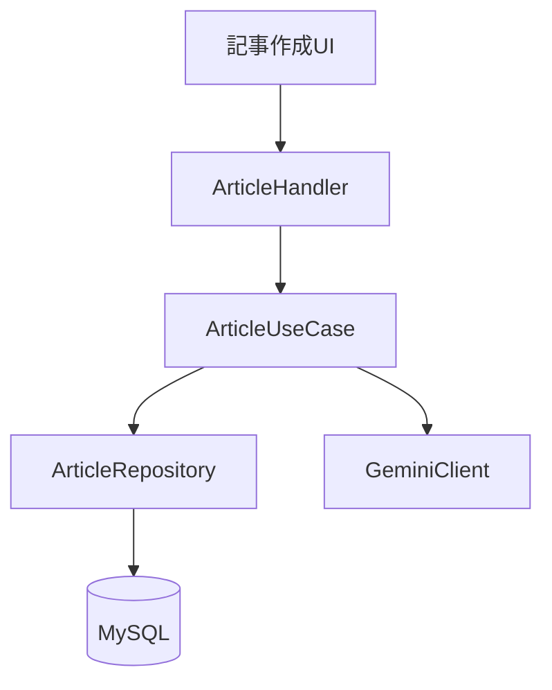
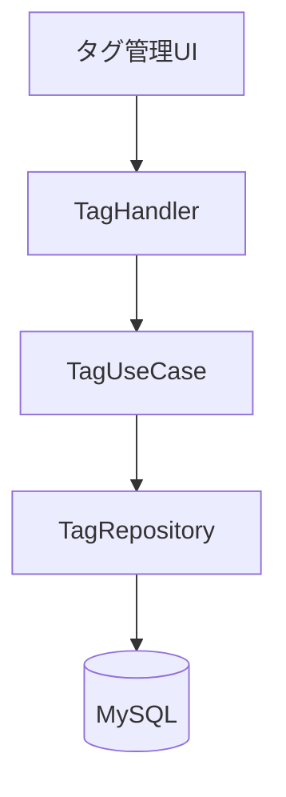
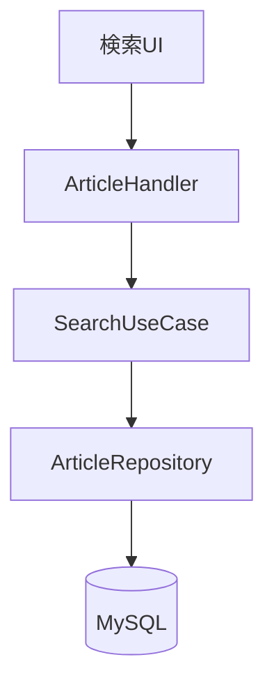
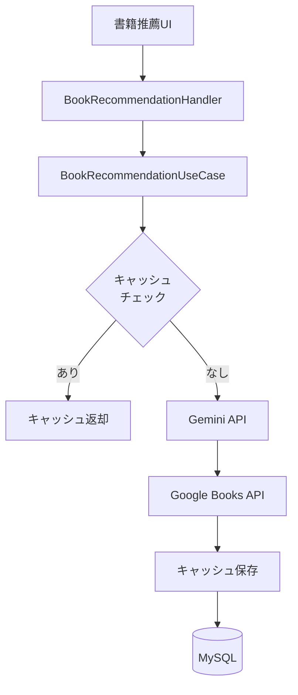
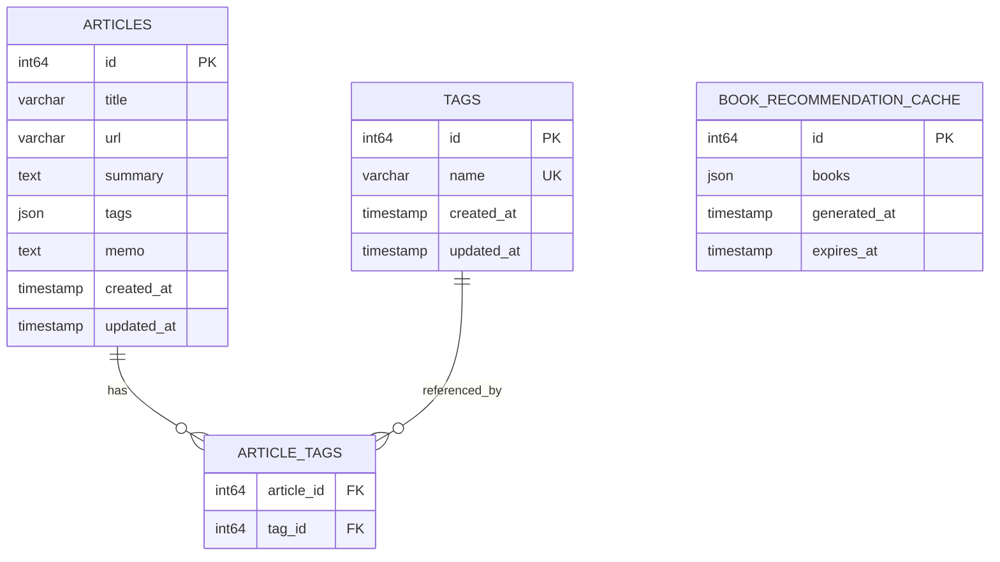
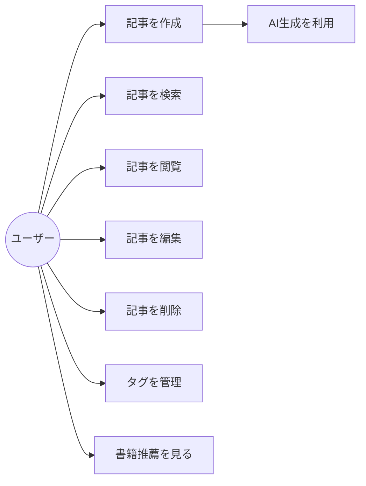
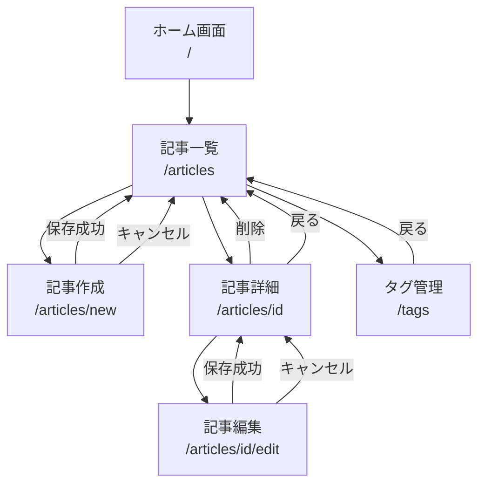
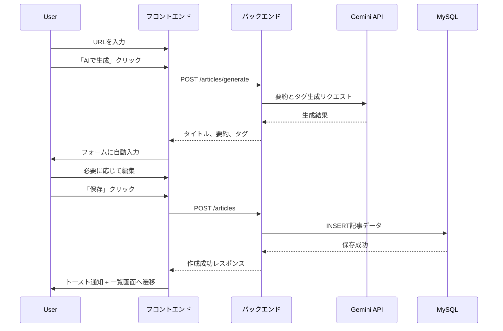

# 機能設計書

## Article Manager - 機能詳細設計

---

## 目次

1. [機能ごとのアーキテクチャ](#1-機能ごとのアーキテクチャ)
2. [API設計](#2-api設計)
3. [データモデル定義](#3-データモデル定義)
4. [ユーザーインターフェース設計](#4-ユーザーインターフェース設計)
5. [コンポーネント設計](#5-コンポーネント設計)
6. [ユースケース図・画面遷移図](#6-ユースケース図画面遷移図)

---

## 1. 機能ごとのアーキテクチャ

### 1.1 記事管理機能



**責務分離**:
- **UI層**: フォーム入力、バリデーション
- **Handler層**: HTTPリクエスト/レスポンス変換
- **UseCase層**: ビジネスロジック、AI統合
- **Repository層**: データアクセス

### 1.2 タグ管理機能



### 1.3 検索機能



**検索処理フロー**:
1. キーワード入力（デバウンス処理）
2. バックエンドAPI呼び出し
3. FULLTEXT検索実行
4. タグフィルタリング適用
5. 結果を返却

### 1.4 書籍推薦機能



**キャッシュ戦略**:
- 有効期限: 24時間
- キャッシュキー: 全記事のタグセットのSHA256ハッシュ値（詳細は3.4節参照）
- キャッシュヒット時はGemini APIとGoogle Books APIの呼び出しをスキップ
- キャッシュミス時は両APIを呼び出して結果をDBに保存

---

## 2. API設計

### 2.1 ベースURL

**開発環境**: `http://localhost:8080/api`
**本番環境**: `https://<domain>/api`

### 2.2 エンドポイント一覧

#### 記事（Articles）

| メソッド | パス | 説明 | 認証 |
|----------|------|------|------|
| GET | `/articles` | 記事一覧取得 | Phase 2で実装 |
| GET | `/articles/search?q={query}&tags={tags}` | 記事検索 | Phase 2で実装 |
| GET | `/articles/{id}` | 記事詳細取得 | Phase 2で実装 |
| POST | `/articles` | 記事作成 | Phase 2で実装 |
| POST | `/articles/generate` | AI記事生成 | Phase 2で実装 |
| PUT | `/articles/{id}` | 記事更新 | Phase 2で実装 |
| DELETE | `/articles/{id}` | 記事削除 | Phase 2で実装 |

#### タグ（Tags）

| メソッド | パス | 説明 | 認証 |
|----------|------|------|------|
| GET | `/tags` | タグ一覧取得 | Phase 2で実装 |
| GET | `/tags/{id}` | タグ詳細取得 | Phase 2で実装 |
| POST | `/tags` | タグ作成 | Phase 2で実装 |
| PUT | `/tags/{id}` | タグ更新 | Phase 2で実装 |
| DELETE | `/tags/{id}` | タグ削除 | Phase 2で実装 |

#### 書籍推薦（Book Recommendations）

| メソッド | パス | 説明 | 認証 |
|----------|------|------|------|
| GET | `/book-recommendations` | 書籍推薦取得 | Phase 2で実装 |

### 2.3 共通HTTPステータスコード

| ステータスコード | 説明 | 使用場面 |
|--------------|------|---------|
| **200 OK** | リクエスト成功 | GET, PUT（更新成功） |
| **201 Created** | リソース作成成功 | POST（作成成功） |
| **204 No Content** | リクエスト成功、レスポンスボディなし | DELETE（削除成功） |
| **400 Bad Request** | バリデーションエラー | 入力値不正 |
| **404 Not Found** | リソースが見つからない | 存在しないID指定 |
| **429 Too Many Requests** | レート制限超過 | リクエスト過多 |
| **500 Internal Server Error** | サーバー内部エラー | 予期しないエラー |
| **503 Service Unavailable** | 外部サービスエラー | AI APIエラー |

### 2.4 リクエスト/レスポンス形式

#### 2.4.1 記事一覧取得（GET /articles）

**クエリパラメータ**:
| パラメータ | 型 | 必須 | デフォルト | 説明 |
|----------|-----|------|----------|------|
| `limit` | int | No | 20 | 取得件数（最大100） |
| `offset` | int | No | 0 | スキップ件数 |
| `sort` | string | No | created_at | ソートフィールド（created_at, updated_at, title） |
| `order` | string | No | desc | ソート順（asc, desc） |

**例**:
```
GET /articles?limit=10&offset=0&sort=created_at&order=desc
```

**レスポンス（200 OK）**:
```json
{
  "articles": [
    {
      "id": 123,
      "title": "記事タイトル",
      "url": "https://example.com/article",
      "summary": "記事の要約テキスト",
      "tags": ["Go", "Backend"],
      "memo": "個人的なメモ",
      "created_at": "2025-01-15T10:30:00Z",
      "updated_at": "2025-01-15T10:30:00Z"
    }
  ],
  "total": 42,
  "limit": 10,
  "offset": 0
}
```

#### 2.4.2 記事詳細取得（GET /articles/{id}）

**パスパラメータ**:
- `id`: 記事ID（整数）

**例**:
```
GET /articles/123
```

**レスポンス（200 OK）**:
```json
{
  "id": 123,
  "title": "記事タイトル",
  "url": "https://example.com/article",
  "summary": "記事の要約テキスト",
  "tags": ["Go", "Backend"],
  "memo": "個人的なメモ",
  "created_at": "2025-01-15T10:30:00Z",
  "updated_at": "2025-01-15T10:30:00Z"
}
```

**レスポンス（404 Not Found）**:
```json
{
  "error": "指定された記事が見つかりません",
  "code": "NOT_FOUND"
}
```

#### 2.4.3 記事作成（POST /articles）

**リクエストボディ**:
```json
{
  "title": "記事タイトル",
  "url": "https://example.com/article",
  "summary": "記事の要約テキスト",
  "tags": ["Go", "Backend"],
  "memo": "個人的なメモ（オプション）"
}
```

**バリデーション**:
- `title`: 必須、最大255文字
- `url`: 必須、有効なURL形式、最大2048文字
- `summary`: 必須、最大1000文字
- `tags`: 配列、各タグ最大50文字、最大10個
- `memo`: オプション、最大65535文字

**レスポンス（201 Created）**:
```json
{
  "id": 123,
  "title": "記事タイトル",
  "url": "https://example.com/article",
  "summary": "記事の要約テキスト",
  "tags": ["Go", "Backend"],
  "memo": "個人的なメモ",
  "created_at": "2025-01-15T10:30:00Z",
  "updated_at": "2025-01-15T10:30:00Z"
}
```

**レスポンス（400 Bad Request）**:
```json
{
  "error": "タイトルは必須です",
  "code": "VALIDATION_ERROR"
}
```

#### 2.4.4 記事更新（PUT /articles/{id}）

**パスパラメータ**:
- `id`: 記事ID（整数）

**リクエストボディ**:
```json
{
  "title": "更新後のタイトル",
  "url": "https://example.com/article",
  "summary": "更新後の要約テキスト",
  "tags": ["Go", "Backend", "API"],
  "memo": "更新後のメモ"
}
```

**バリデーション**:
- すべてのフィールドは必須（部分更新ではなく全体更新）
- 制約は作成時と同じ

**レスポンス（200 OK）**:
```json
{
  "id": 123,
  "title": "更新後のタイトル",
  "url": "https://example.com/article",
  "summary": "更新後の要約テキスト",
  "tags": ["Go", "Backend", "API"],
  "memo": "更新後のメモ",
  "created_at": "2025-01-15T10:30:00Z",
  "updated_at": "2025-01-15T11:45:00Z"
}
```

**レスポンス（404 Not Found）**:
```json
{
  "error": "指定された記事が見つかりません",
  "code": "NOT_FOUND"
}
```

#### 2.4.5 記事削除（DELETE /articles/{id}）

**パスパラメータ**:
- `id`: 記事ID（整数）

**例**:
```
DELETE /articles/123
```

**レスポンス（204 No Content）**:
レスポンスボディなし

**レスポンス（404 Not Found）**:
```json
{
  "error": "指定された記事が見つかりません",
  "code": "NOT_FOUND"
}
```

#### 2.4.6 AI記事生成（POST /articles/generate）

**リクエストボディ**:
```json
{
  "url": "https://example.com/article"
}
```

**レスポンス（成功時）**:
```json
{
  "title": "AI生成されたタイトル",
  "summary": "AI生成された要約",
  "tags": ["AI抽出タグ1", "AI抽出タグ2"]
}
```

**処理フロー**:
1. URLからHTMLコンテンツを取得
2. Gemini APIで要約とタグを生成
3. 生成結果を返却（まだ保存しない）

**レスポンス（400 Bad Request）**:
```json
{
  "error": "有効なURLを指定してください",
  "code": "VALIDATION_ERROR"
}
```

**レスポンス（503 Service Unavailable）**:
```json
{
  "error": "AI生成サービスが一時的に利用できません",
  "code": "AI_SERVICE_ERROR"
}
```

#### 2.4.7 記事検索（GET /articles/search）

**クエリパラメータ**:
- `q`: 検索キーワード（オプション）
- `tags`: カンマ区切りのタグ名（オプション）

**例**:
```
GET /articles/search?q=Kubernetes&tags=Go,Backend
```

**レスポンス**:
```json
{
  "articles": [
    {
      "id": 123,
      "title": "Kubernetes入門",
      "url": "https://example.com/k8s",
      "summary": "Kubernetesの基本...",
      "tags": ["Go", "Backend", "Kubernetes"],
      "created_at": "2025-01-15T10:30:00Z"
    }
  ],
  "total": 42
}
```

#### 2.4.8 タグ一覧取得（GET /tags）

**クエリパラメータ**:
| パラメータ | 型 | 必須 | デフォルト | 説明 |
|----------|-----|------|----------|------|
| `sort` | string | No | name | ソートフィールド（name, created_at） |
| `order` | string | No | asc | ソート順（asc, desc） |

**例**:
```
GET /tags?sort=name&order=asc
```

**レスポンス（200 OK）**:
```json
{
  "tags": [
    {
      "id": 1,
      "name": "Go",
      "article_count": 15,
      "created_at": "2025-01-10T09:00:00Z",
      "updated_at": "2025-01-10T09:00:00Z"
    },
    {
      "id": 2,
      "name": "Backend",
      "article_count": 8,
      "created_at": "2025-01-11T10:00:00Z",
      "updated_at": "2025-01-11T10:00:00Z"
    }
  ],
  "total": 2
}
```

**注**: `article_count`はリアルタイム集計（JOIN）で取得します。

#### 2.4.9 タグ詳細取得（GET /tags/{id}）

**パスパラメータ**:
- `id`: タグID（整数）

**例**:
```
GET /tags/1
```

**レスポンス（200 OK）**:
```json
{
  "id": 1,
  "name": "Go",
  "article_count": 15,
  "created_at": "2025-01-10T09:00:00Z",
  "updated_at": "2025-01-10T09:00:00Z"
}
```

**レスポンス（404 Not Found）**:
```json
{
  "error": "指定されたタグが見つかりません",
  "code": "NOT_FOUND"
}
```

#### 2.4.10 タグ作成（POST /tags）

**リクエストボディ**:
```json
{
  "name": "Kubernetes"
}
```

**バリデーション**:
- `name`: 必須、最大50文字、ユニーク制約

**レスポンス（201 Created）**:
```json
{
  "id": 3,
  "name": "Kubernetes",
  "article_count": 0,
  "created_at": "2025-01-15T12:00:00Z",
  "updated_at": "2025-01-15T12:00:00Z"
}
```

**レスポンス（400 Bad Request）**:
```json
{
  "error": "このタグ名は既に使用されています",
  "code": "VALIDATION_ERROR"
}
```

#### 2.4.11 タグ更新（PUT /tags/{id}）

**パスパラメータ**:
- `id`: タグID（整数）

**リクエストボディ**:
```json
{
  "name": "Go言語"
}
```

**バリデーション**:
- `name`: 必須、最大50文字、ユニーク制約

**レスポンス（200 OK）**:
```json
{
  "id": 1,
  "name": "Go言語",
  "article_count": 15,
  "created_at": "2025-01-10T09:00:00Z",
  "updated_at": "2025-01-15T13:00:00Z"
}
```

**レスポンス（404 Not Found）**:
```json
{
  "error": "指定されたタグが見つかりません",
  "code": "NOT_FOUND"
}
```

**レスポンス（400 Bad Request）**:
```json
{
  "error": "このタグ名は既に使用されています",
  "code": "VALIDATION_ERROR"
}
```

**注意**: タグ名を変更すると、そのタグを持つすべての記事のJSONフィールドも更新する必要があります（Phase 1の場合）。

#### 2.4.12 タグ削除（DELETE /tags/{id}）

**パスパラメータ**:
- `id`: タグID（整数）

**例**:
```
DELETE /tags/3
```

**制約**:
- **使用中のタグは削除不可**（article_count > 0の場合）

**レスポンス（204 No Content）**:
レスポンスボディなし

**レスポンス（400 Bad Request）**:
```json
{
  "error": "使用中のタグは削除できません。先に記事から削除してください。",
  "code": "VALIDATION_ERROR"
}
```

**レスポンス（404 Not Found）**:
```json
{
  "error": "指定されたタグが見つかりません",
  "code": "NOT_FOUND"
}
```

#### 2.4.13 書籍推薦取得（GET /book-recommendations）

**レスポンス（200 OK）**:
```json
{
  "recommendations": [
    {
      "title": "詳解Go言語",
      "authors": ["山田太郎"],
      "publisher": "技術評論社",
      "published_date": "2024-01-01",
      "description": "Go言語の詳細な解説書...",
      "thumbnail": "https://books.google.com/...",
      "info_link": "https://books.google.com/books?id=..."
    }
  ],
  "generated_at": "2025-01-15T10:30:00Z",
  "cached": false
}
```

**レスポンス（503 Service Unavailable）**:
```json
{
  "error": "書籍推薦サービスが一時的に利用できません",
  "code": "AI_SERVICE_ERROR"
}
```

### 2.5 エラーコード一覧

| コード | HTTPステータス | 説明 | 発生場面 |
|-------|--------------|------|---------|
| `VALIDATION_ERROR` | 400 | 入力バリデーションエラー | 必須項目欠落、文字数超過、形式不正 |
| `NOT_FOUND` | 404 | リソースが見つからない | 存在しないID指定 |
| `INTERNAL_ERROR` | 500 | サーバー内部エラー | DB接続エラー、予期しない例外 |
| `AI_SERVICE_ERROR` | 503 | AI APIサービスエラー | Gemini API障害、タイムアウト |
| `RATE_LIMIT_EXCEEDED` | 429 | レート制限超過 | 短時間に大量リクエスト |

### 2.6 レート制限

| エンドポイント | 制限値 | ウィンドウ |
|--------------|--------|----------|
| **全体** | 100リクエスト | 1分/IP |
| **全体** | 1,000リクエスト | 1時間/IP |
| **POST /articles/generate** | 10リクエスト | 1時間/IP |
| **GET /book-recommendations** | 20リクエスト | 1時間/IP |

**レート制限時のレスポンス**:
```json
{
  "error": "レート制限を超過しました。しばらくしてから再度お試しください。",
  "code": "RATE_LIMIT_EXCEEDED",
  "retry_after": 3600
}
```

---

## 3. データモデル定義

### 3.1 ER図



**Phase 1のデータ設計**:
- `ARTICLES`テーブルの`tags`フィールドはJSON型で管理（例: `["Go", "Backend"]`）
- `TAGS`テーブルは**参照用マスタとして存在**（タグの一覧取得、編集、削除管理に使用）
- `ARTICLE_TAGS`中間テーブルは**作成しません**（ER図は将来の拡張を示す）

**タグ管理の動作**:
1. **記事作成時**: `tags` JSONフィールドに配列として保存
2. **タグ一覧取得時**: `ARTICLES.tags`フィールドからJSONを抽出して集計
3. **タグ名変更時**: 該当タグを持つ全記事の`tags` JSONフィールドを更新
4. **タグ削除時**: 使用中（article_count > 0）の場合はエラー

**Phase 2への移行計画**:
- パフォーマンス改善のため、`ARTICLE_TAGS`中間テーブルを導入予定
- マイグレーションで既存の`tags` JSONから中間テーブルへデータ移行
- `tags` JSONフィールドは互換性のため残す（読み取り専用）

### 3.2 記事（Articles）テーブル

| フィールド | 型 | 制約 | 説明 |
|------------|-------|------|------|
| `id` | INT64 | PRIMARY KEY, AUTO_INCREMENT | 記事ID |
| `title` | VARCHAR(255) | NOT NULL | タイトル |
| `url` | VARCHAR(2048) | NOT NULL | 記事URL |
| `summary` | TEXT(1000) | NOT NULL | 要約 |
| `tags` | JSON | NOT NULL | タグ配列（例: `["Go", "Backend"]`） |
| `memo` | TEXT | NULL | メモ |
| `created_at` | TIMESTAMP | NOT NULL, DEFAULT CURRENT_TIMESTAMP | 作成日時 |
| `updated_at` | TIMESTAMP | NOT NULL, DEFAULT CURRENT_TIMESTAMP ON UPDATE CURRENT_TIMESTAMP | 更新日時 |

**インデックス**:
```sql
PRIMARY KEY (id)
INDEX idx_created_at (created_at)
FULLTEXT INDEX ft_idx_title_summary (title, summary)
```

**制約**:
- `url`: ユニーク制約は設けない（同じ記事を複数回保存可能）
- `tags`: 必ず配列形式のJSON（例: `[]`, `["Go"]`）

### 3.3 タグ（Tags）テーブル

| フィールド | 型 | 制約 | 説明 |
|------------|-------|------|------|
| `id` | INT64 | PRIMARY KEY, AUTO_INCREMENT | タグID |
| `name` | VARCHAR(50) | NOT NULL, UNIQUE | タグ名 |
| `created_at` | TIMESTAMP | NOT NULL, DEFAULT CURRENT_TIMESTAMP | 作成日時 |
| `updated_at` | TIMESTAMP | NOT NULL, DEFAULT CURRENT_TIMESTAMP ON UPDATE CURRENT_TIMESTAMP | 更新日時 |

**インデックス**:
```sql
PRIMARY KEY (id)
UNIQUE INDEX uk_name (name)
```

**制約**:
- `name`: 大文字小文字を区別（"Go" と "go" は別タグ）

### 3.4 書籍推薦キャッシュ（BookRecommendationCache）テーブル

| フィールド | 型 | 制約 | 説明 |
|------------|-------|------|------|
| `id` | INT64 | PRIMARY KEY, AUTO_INCREMENT | ID |
| `books` | JSON | NOT NULL | 書籍情報配列 |
| `generated_at` | TIMESTAMP | NOT NULL | 生成日時 |
| `expires_at` | TIMESTAMP | NOT NULL | 有効期限 |

**インデックス**:
```sql
PRIMARY KEY (id)
INDEX idx_expires_at (expires_at)
```

**キャッシュキーの生成方法**:

Phase 1では、**全記事のタグ集合**に基づいてキャッシュキーを生成します。

```pseudo
キャッシュキー生成アルゴリズム:
1. 全記事のtagsフィールドからタグを抽出
2. 重複を除いてユニークなタグリストを作成
3. タグリストをアルファベット順にソート
4. JSON文字列化: JSON.stringify(sortedTags)
5. SHA256ハッシュ化: SHA256(jsonString)
6. ハッシュ値をキャッシュキーとして使用
```

**具体例**:
```typescript
// 記事1: ["Go", "Backend"]
// 記事2: ["Go", "Frontend"]
// 記事3: ["Python", "Backend"]

const allTags = ["Go", "Backend", "Frontend", "Python"];
const sortedTags = ["Backend", "Frontend", "Go", "Python"];
const jsonString = '["Backend","Frontend","Go","Python"]';
const cacheKey = SHA256(jsonString); // "a1b2c3d4..."
```

**キャッシュ無効化条件**:
- 記事の追加/削除でタグセットが変化した場合
- `expires_at`を過ぎた場合（24時間）

**キャッシュクリーンアップ**:
- 定期的に`expires_at < NOW()`のレコードを削除（バッチ処理またはCRON）

**books JSONスキーマ例**:
```json
[
  {
    "title": "詳解Go言語",
    "authors": ["山田太郎"],
    "publisher": "技術評論社",
    "published_date": "2024-01-01",
    "description": "Go言語の詳細な解説書...",
    "thumbnail": "https://books.google.com/...",
    "info_link": "https://books.google.com/books?id=..."
  }
]
```

---

## 4. ユーザーインターフェース設計

### 4.1 画面構成

#### 4.1.1 ホーム画面（/）

**目的**: アプリケーションのエントリーポイント

**表示内容**:
- アプリケーション名とロゴ
- ナビゲーションメニュー
- 簡単な説明文
- 「記事一覧を見る」ボタン

**将来的な拡張**:
- ダッシュボード機能（統計情報、最近の記事など）

#### 4.1.2 記事一覧画面（/articles）

**レイアウト**:
```
┌─────────────────────────────────────┐
│ Header (サイト名、ナビゲーション)    │
├─────────────────────────────────────┤
│ SearchBar (検索ボックス)            │
├─────────────────────────────────────┤
│ BookRecommendations (書籍推薦)      │
├─────────────────────────────────────┤
│ TagFilter (タグフィルター)          │
├─────────────────────────────────────┤
│ ┌─────┐ ┌─────┐ ┌─────┐          │
│ │Card │ │Card │ │Card │ ...      │
│ └─────┘ └─────┘ └─────┘          │
├─────────────────────────────────────┤
│ Pagination (ページネーション)        │
└─────────────────────────────────────┘
```

**コンポーネント**:
- **検索バー**: キーワード検索入力、デバウンス処理
- **タグフィルター**: タグボタン一覧、複数選択可能
- **記事カード**: タイトル、要約、タグ、日時、編集・削除ボタン
- **ページネーション**: ページ切り替え（必要に応じて）

**インタラクション**:
- 検索入力: リアルタイム検索（300msデバウンス）
- タグクリック: タグでフィルタリング
- カードクリック: 記事詳細画面へ遷移

#### 4.1.3 記事作成画面（/articles/new）

**フォーム項目**:
1. **URL入力** + 「AIで生成」ボタン
   - URL入力後、ボタンクリックでAI生成
   - ローディングスピナー表示
   - 生成結果を自動入力

2. **タイトル入力**
   - 最大255文字
   - リアルタイム文字数カウンター

3. **要約入力（テキストエリア）**
   - 最大1000文字
   - リアルタイム文字数カウンター

4. **タグ選択（複数選択可能）**
   - ドロップダウンまたはチェックボックス
   - 最大10個まで選択可能

5. **メモ入力（テキストエリア）**
   - オプション
   - 最大65535文字

6. **保存ボタン、キャンセルボタン**

**バリデーション**:
- クライアント側: リアルタイムバリデーション
- サーバー側: 最終バリデーション

**UI特徴**:
- エラーメッセージはフィールド直下に表示
- AI生成中はフォームを無効化
- 保存成功時はトースト通知 + 記事一覧画面へ遷移

#### 4.1.4 記事詳細画面（/articles/[id]）

**表示内容**:
- **タイトル**（大見出し）
- **URL**（リンク、新しいタブで開く）
- **要約**
- **タグ一覧**（バッジ表示）
- **メモ**（折りたたみ可能）
- **作成日時、更新日時**（小さく表示）
- **編集ボタン、削除ボタン**

**インタラクション**:
- URLクリック: 元記事をブラウザで開く
- タグクリック: そのタグでフィルタリングした一覧画面へ遷移
- 編集ボタン: 記事編集画面へ遷移
- 削除ボタン: 確認ダイアログ表示後、削除実行

#### 4.1.5 記事編集画面（/articles/[id]/edit）

**フォーム**:
- 記事作成画面と同様のフォーム
- 現在の値が初期値として表示
- AI生成ボタンは非表示（編集時は手動のみ）

#### 4.1.6 タグ管理画面（/tags）

**表示内容**:
- **タグ一覧テーブル**
  - タグ名
  - 記事数（そのタグを持つ記事の数）
  - 作成日時
  - 編集ボタン、削除ボタン
- **新規タグ作成ボタン**

**インタラクション**:
- 新規作成ボタン: モーダルまたは別画面でタグ作成
- 編集ボタン: タグ名変更
- 削除ボタン: 確認ダイアログ表示後、削除実行
  - 使用中のタグは削除不可（警告メッセージ）

### 4.2 デザインシステム

#### 4.2.1 カラーパレット

| 用途 | カラー | Tailwind CSS |
|-----|--------|--------------|
| **プライマリ** | Indigo-Purple グラデーション | `bg-gradient-to-r from-indigo-600 to-purple-600` |
| **セカンダリ** | Gray | `gray-100` ~ `gray-900` |
| **成功** | Green | `green-600` |
| **エラー** | Red | `red-600` |
| **警告** | Yellow | `yellow-600` |
| **背景** | White / Gray-50 | `bg-white`, `bg-gray-50` |

#### 4.2.2 タイポグラフィ

| 要素 | フォントサイズ | 太さ | Tailwind CSS |
|-----|-------------|------|--------------|
| **大見出し** | 30px (3xl) | Bold | `text-3xl font-bold` |
| **見出し** | 24px (2xl) | Bold | `text-2xl font-bold` |
| **小見出し** | 18px (lg) | Semibold | `text-lg font-semibold` |
| **本文** | 16px (base) | Regular | `text-base` |
| **小テキスト** | 14px (sm) | Regular | `text-sm` |

**フォントファミリー**: システムフォント（`-apple-system, BlinkMacSystemFont, sans-serif`）

#### 4.2.3 スペーシング

Tailwind CSSのデフォルトスペーシングスケールを使用:
- 基本単位: 4px (0.25rem)
- 主に使用: `p-4`, `m-4`, `gap-4`, `space-y-4`

#### 4.2.4 コンポーネントスタイル

**ボタン**:
```jsx
// プライマリボタン
<button className="px-4 py-2 bg-gradient-to-r from-indigo-600 to-purple-600 text-white rounded-lg hover:from-indigo-700 hover:to-purple-700 transition">
  保存
</button>

// セカンダリボタン
<button className="px-4 py-2 bg-gray-200 text-gray-800 rounded-lg hover:bg-gray-300 transition">
  キャンセル
</button>
```

**カード**:
```jsx
<div className="bg-white p-6 rounded-lg shadow-md border border-gray-200 hover:shadow-lg transition">
  {/* カード内容 */}
</div>
```

**入力欄**:
```jsx
<input
  className="w-full px-3 py-2 border border-gray-300 rounded-md focus:outline-none focus:ring-2 focus:ring-indigo-500"
  type="text"
/>
```

**タグバッジ**:
```jsx
<span className="px-2 py-1 bg-indigo-100 text-indigo-800 text-sm rounded-full">
  Go
</span>
```

---

## 5. コンポーネント設計

### 5.1 フロントエンドコンポーネント階層

```
app/
├── layout.tsx                    # ルートレイアウト
├── page.tsx                      # ホームページ
├── articles/
│   ├── page.tsx                  # 記事一覧ページ
│   ├── new/
│   │   └── page.tsx              # 記事作成ページ
│   └── [id]/
│       ├── page.tsx              # 記事詳細ページ
│       └── edit/
│           └── page.tsx          # 記事編集ページ
└── tags/
    └── page.tsx                  # タグ管理ページ

components/
├── ArticleCard.tsx               # 記事カードコンポーネント
├── ArticleForm.tsx               # 記事フォームコンポーネント
├── SearchBar.tsx                 # 検索バーコンポーネント
├── TagFilter.tsx                 # タグフィルターコンポーネント
├── BookRecommendations.tsx       # 書籍推薦コンポーネント
├── Pagination.tsx                # ページネーションコンポーネント
├── ErrorBoundary.tsx             # エラーバウンダリー
└── Toast.tsx                     # トースト通知コンポーネント

hooks/
├── useArticles.ts                # 記事CRUD操作フック
├── useArticleSearch.ts           # 記事検索フック
├── useTags.ts                    # タグ操作フック
└── useBookRecommendations.ts     # 書籍推薦フック
```

### 5.2 主要コンポーネント仕様

#### ArticleCard

**Props**:
```typescript
interface ArticleCardProps {
  id: number;
  title: string;
  url: string;
  summary: string;
  tags: string[];
  createdAt: string;
  onDelete: (id: number) => void;
}
```

**責務**:
- 記事情報を視覚的に表示
- 編集・削除ボタンのイベントハンドリング

#### ArticleForm

**Props**:
```typescript
interface ArticleFormProps {
  initialValues?: Article;
  onSubmit: (article: ArticleInput) => void;
  onCancel: () => void;
  mode: 'create' | 'edit';
}
```

**責務**:
- フォーム入力管理
- クライアント側バリデーション
- AI生成機能の統合（作成モードのみ）

#### SearchBar

**Props**:
```typescript
interface SearchBarProps {
  onSearch: (query: string) => void;
  placeholder?: string;
}
```

**責務**:
- 検索キーワード入力
- デバウンス処理（300ms）

#### TagFilter

**Props**:
```typescript
interface TagFilterProps {
  tags: Tag[];
  selectedTags: string[];
  onTagSelect: (tagName: string) => void;
  onTagDeselect: (tagName: string) => void;
}

interface Tag {
  id: number;
  name: string;
  article_count: number;
}
```

**責務**:
- タグボタン一覧を表示
- 複数タグ選択/解除のトグル機能
- 選択中のタグをハイライト表示

**UI**:
- タグボタン（未選択: グレー、選択中: プライマリカラー）
- 記事数をバッジで表示

#### Pagination

**Props**:
```typescript
interface PaginationProps {
  total: number;        // 総アイテム数
  limit: number;        // 1ページあたりのアイテム数
  offset: number;       // 現在のオフセット
  onPageChange: (newOffset: number) => void;
}
```

**責務**:
- ページ番号の計算と表示
- 前へ/次へボタンの有効/無効制御
- ページ番号クリックでページ遷移

**UI**:
- 前へ/次へボタン
- ページ番号一覧（最大5ページ分を表示）
- 現在ページをハイライト

**計算ロジック**:
```typescript
const currentPage = Math.floor(offset / limit) + 1;
const totalPages = Math.ceil(total / limit);
const hasNext = offset + limit < total;
const hasPrev = offset > 0;
```

#### BookRecommendations

**Props**:
```typescript
interface BookRecommendationsProps {
  onRefresh?: () => void;
}

interface BookRecommendation {
  title: string;
  authors: string[];
  publisher: string;
  published_date: string;
  description: string;
  thumbnail: string;
  info_link: string;
}
```

**責務**:
- 書籍推薦データの取得と表示
- ローディング状態の表示
- エラー時の再試行ボタン表示
- 書籍カードのレイアウト

**UI**:
- 横スクロール可能な書籍カード一覧
- 各カード: サムネイル、タイトル、著者、出版社
- 「詳細を見る」リンク（外部リンク）
- 更新ボタン（キャッシュクリア）

**状態**:
- loading: ローディング中
- error: エラー発生
- success: データ取得成功

#### Toast

**Props**:
```typescript
interface ToastProps {
  message: string;
  type: 'success' | 'error' | 'warning' | 'info';
  duration?: number;      // 表示時間（ms）デフォルト3000
  onClose: () => void;
}
```

**責務**:
- 通知メッセージの一時表示
- 自動非表示（duration後）
- 手動閉じるボタン
- 複数トーストのスタック表示

**UI**:
- 画面右上に固定表示
- タイプ別カラー（success: 緑、error: 赤、warning: 黄、info: 青）
- アニメーション（フェードイン/アウト）
- 閉じるボタン（×）

**使用例**:
```typescript
// 成功時
showToast({ message: '記事を保存しました', type: 'success' });

// エラー時
showToast({ message: '保存に失敗しました', type: 'error' });
```

#### ErrorBoundary

**Props**:
```typescript
interface ErrorBoundaryProps {
  children: React.ReactNode;
  fallback?: React.ComponentType<{ error: Error; reset: () => void }>;
}
```

**責務**:
- Reactコンポーネントツリーのエラーキャッチ
- エラー情報のロギング
- フォールバックUIの表示
- リセット機能（エラー状態から復帰）

**UI（デフォルトフォールバック）**:
- エラーメッセージ表示
- 「再試行」ボタン
- 「ホームに戻る」ボタン

**実装**:
```typescript
class ErrorBoundary extends React.Component<ErrorBoundaryProps, ErrorBoundaryState> {
  static getDerivedStateFromError(error: Error) {
    return { hasError: true, error };
  }

  componentDidCatch(error: Error, errorInfo: React.ErrorInfo) {
    console.error('ErrorBoundary caught:', error, errorInfo);
  }

  reset = () => {
    this.setState({ hasError: false, error: null });
  };
}
```

---

## 6. ユースケース図・画面遷移図

### 6.1 ユースケース図



### 6.2 画面遷移図



### 6.3 記事作成フロー



---

## 変更履歴

| 日付 | バージョン | 変更内容 | 担当者 |
|-----|-----------|---------|-------|
| 2025-01-03 | 1.0 | 初版作成 | - |
| 2026-02-13 | 1.1 | product-requirements.mdから分離 | - |
| 2026-02-13 | 1.2 | 優先度HIGH: API仕様完全化、主要コンポーネント仕様追加、データモデル曖昧さ解消 | - |

---

**注意**: このドキュメントは永続的ドキュメントとして管理されます。機能の追加や変更時に更新してください。
